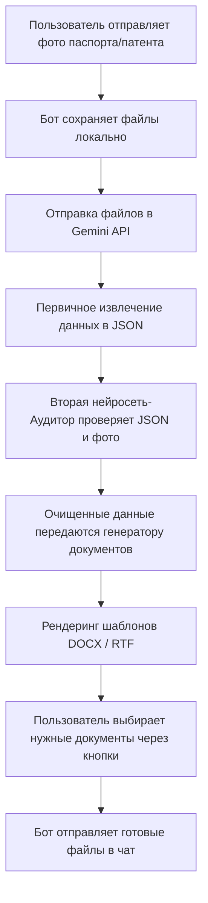

# 📄 Auto-Docs Bot (HR-Автоматизация)

Telegram-бот для автоматического распознавания документов (фото/сканов паспорта и патентов) и генерации заполненных кадровых документов по шаблонам (Договор о приеме, Уведомление о расторжении).

Бот полностью избавляет от ручной рутины переноса данных и опечаток, выполняя всю работу за 15-20 секунд.

---

## 🌟 Основные возможности

*   **Интеллектуальное распознавание (AI Vision):** Обработка фотографий и сканов документов под любым углом через API Google Gemini.
*   **Двойная ИИ-проверка (Аудитор):** Второй проход нейросети сверяет извлеченные данные с исходными изображениями, исправляет опечатки, форматирует даты и приводит имена к красивому регистру.
*   **Генерация в разных форматах:** Автоматическое заполнение шаблонов `DOCX` (Договор подряда) и `RTF` (Уведомление о расторжении).
*   **Интерактивный UI в Telegram:** Выбор необходимых документов для генерации с помощью встроенных кнопок и быстрого меню команд.

---

## 🚀 Быстрый старт

### 1. Требования
*   Python 3.10+
*   Токен Telegram-бота (от [@BotFather](https://t.me/BotFather))
*   Бесплатный API-ключ Gemini (можно получить на [Google AI Studio](https://aistudio.google.com/))

### 2. Установка
Клонируйте репозиторий и установите необходимые зависимости:

```bash
git clone https://github.com/your-username/auto-docs-bot.git
cd auto-docs-bot

# Установка библиотек
pip install python-docx aiogram google-genai docxtpl
```

### 3. Настройка переменных окружения
Создайте файл `.env` в корне проекта или экспортируйте переменные в терминале:

```bash
export BOT_TOKEN="ваш_токен_телеграм_бота"
export GEMINI_API_KEY="ваш_ключ_gemini_api"
```

### 4. Запуск
```bash
python3 bot/bot.py
```

---

## 🛠 Как это устроено под капотом



---

## 📁 Структура проекта

```text
├── bot/
│   ├── bot.py             # Точка входа, логика Telegram-бота
│   ├── extractor.py       # Взаимодействие с Gemini API (распознавание + аудит)
│   ├── generator.py       # Подстановка данных в шаблоны DOCX и RTF
│   └── templates/         # Папка с шаблонами документов
│       ├── template_contract.docx     # Шаблон договора
│       └── template_termination.rtf   # Шаблон уведомления
├── prepare_templates.py   # Скрипт для подготовки шаблонов из оригиналов
├── .gitignore             # Игнорируемые файлы (логи, кэш, ключи)
└── README.md              # Документация проекта
```

---

## 📝 Настройка шаблонов
Все шаблоны лежат в папке `bot/templates/`. Вы можете использовать переменные Jinja-стиля (в двойных фигурных скобках) для разметки ваших собственных документов:
*   `{{full_name}}` — ФИО сотрудника
*   `{{citizenship}}` — Гражданство
*   `{{birth_date}}` — Дата рождения
*   `{{passport_series}}` — Серия паспорта
*   `{{passport_number}}` — Номер паспорта
*   `{{passport_issue_date}}` — Дата выдачи паспорта
*   `{{passport_issued_by}}` — Кем выдан паспорт
